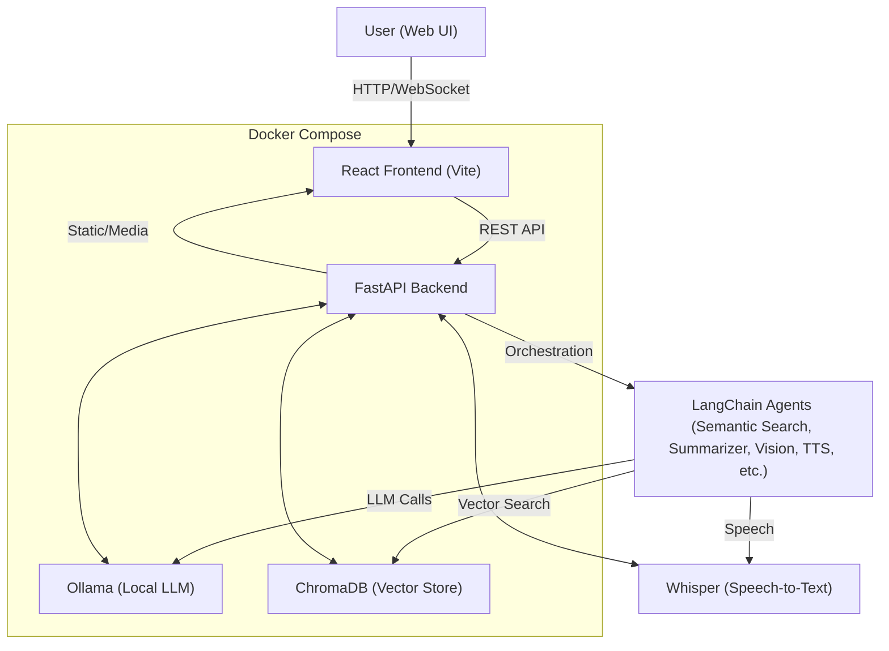

# Neurofluxion AI - Orchestrating Intelligence

A comprehensive multi-agent AI assistant system built with FastAPI, LangChain, LangGraph, and a modern React frontend. Features a local-first architecture with voice, vision, and text capabilities, and is designed for privacy, extensibility, and offline use.

## 🚀 Features

- **Multi-Agent Architecture**: Modular LangChain agents with specialized capabilities (semantic search, summarization, vision, TTS, etc.)
- **Local-First Design**: Works entirely with local models (Ollama for LLM, Whisper for speech, ChromaDB for vector search)
- **Voice Capabilities**: Speech-to-text (Whisper) and text-to-speech (TTS) processing
- **Vision Processing**: Image analysis and OCR capabilities
- **Semantic Search**: ChromaDB-powered vector search with domain-adaptable embeddings
- **Dual Theme UI**: Professional light/dark mode interface
- **Real-Time Status**: Live agent monitoring and system metrics
- **Dockerized Deployment**: One-command startup for the entire stack

## 🏗️ System Architecture



### **Component Overview**

- **Frontend (React + Vite):**
  - Modern UI for chat, voice, and vision interactions
  - Real-time agent status and dual theme support
- **Backend (FastAPI):**
  - Orchestrates agent workflow and handles API requests
  - Manages user queries, agent routing, and post-processing
- **LangChain Agents:**
  - **Semantic Search:** Retrieves relevant documents using embeddings and ChromaDB
  - **Summarizer:** Summarizes long responses or documents
  - **Vision:** Handles image analysis and OCR
  - **TTS:** Converts text responses to speech
- **Ollama:**
  - Local LLM for all language generation and intent analysis
- **Whisper:**
  - Local speech-to-text for voice input
- **ChromaDB:**
  - Vector database for storing and searching document embeddings

## 🛠️ Getting Started

1. **Clone the repository:**
   ```bash
   git clone <repo-url>
   cd NeurofluxAI
   ```
2. **Start with Docker Compose:**
   ```bash
   docker-compose up --build
   ```
3. **Access the app:**
   - Frontend: [http://localhost:5000](http://localhost:5000)
   - Backend API: [http://localhost:8000](http://localhost:8000)

## 📝 Customization & Domain Adaptation

- To adapt for a specific domain (e.g., e-commerce, healthcare):
  - Ingest domain-specific documents into ChromaDB
  - Use or fine-tune domain-specific embedding models
  - Customize agent prompts and logic for your use case

## 📄 License

MIT License. See LICENSE for details.

